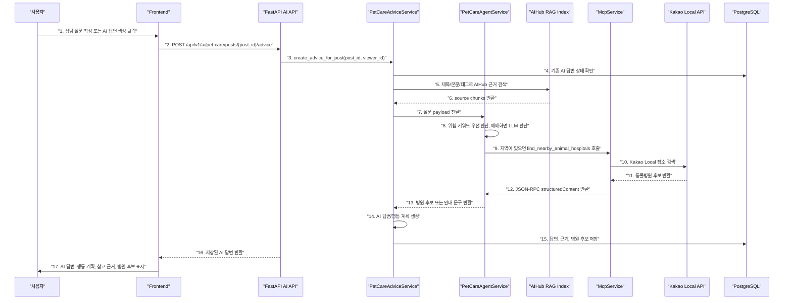
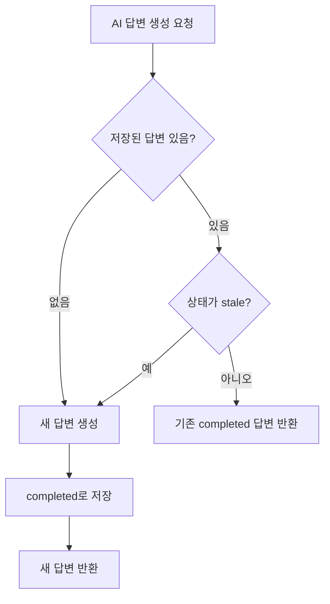

# Sprint 8 Agent Implementation Record

## 1. 구현 요약

Sprint 8에서는 AI 답변 생성 흐름에 **Agent + MCP 동물병원 검색**을 연결했다.

구현 결과:

- 게시글의 `region`은 이제 실제 지역으로 사용한다.
  - 예: `서울 마포구`
- 생애주기/나이/견종은 별도 필드로 받지 않고 제목/본문/태그에서 판단한다.
- Agent는 병원 안내가 필요한 질문인지 판단한다.
- 지역이 있고 병원 안내가 필요하면 MCP JSON-RPC tool을 내부 호출한다.
- Kakao Local API 결과로 받은 동물병원 후보를 AI 답변과 함께 저장한다.
- 완료된 AI 답변은 반복 재생성하지 않고, 게시글 수정으로 `stale` 된 경우에만 재생성한다.

## 2. 데이터 구조 변경

`pet_care_advices`에 JSON 컬럼을 추가했다.

```text
hospital_candidates JSON NOT NULL DEFAULT []
```

저장 예시:

```json
[
  {
    "name": "시그널동물의료센터",
    "address": "서울 마포구 성산동 592-8",
    "road_address": "서울 마포구 모래내로1길 9",
    "phone": "0507-1327-1873",
    "distance_meters": 229,
    "place_url": "http://place.map.kakao.com/930199142",
    "source": "kakao_local"
  }
]
```

확인할 코드:

- `backend/app/models/pet_care_advice.py`
  - `PetCareAdvice.hospital_candidates`
- `backend/app/db/schema.py`
  - `ensure_development_schema`
  - 기존 DB에 `hospital_candidates` 컬럼이 없으면 추가
- `backend/app/schemas/ai.py`
  - `PetCareHospitalCandidate`
  - `PetCareAdviceResponse.hospital_candidates`
- `backend/app/repositories/pet_care_advice_repository.py`
  - `upsert_completed`
  - AI 답변 저장 시 병원 후보도 함께 저장

## 3. 전체 흐름



## 4. 번호별 코드 확인

### 1. 상담 질문 작성 또는 AI 답변 생성 클릭

확인할 코드:

- `frontend/src/components/ComposeModal.tsx`
  - `region` 입력 라벨을 `지역 (선택)`으로 변경
  - placeholder는 `서울 마포구`
- `frontend/src/hooks/usePosts.ts`
  - 기본 샘플 입력의 `region`도 `서울 마포구`로 변경

의미:

- 생애주기는 더 이상 별도 입력하지 않는다.
- `region`은 병원 검색에 사용할 실제 지역이다.

### 2. POST `/api/v1/ai/pet-care/posts/{post_id}/advice`

확인할 코드:

- `frontend/src/hooks/usePetCareAdvice.ts`
  - `generateForPost`
  - `generateForCreatedPost`
- `backend/app/api/v1/ai.py`
  - `create_pet_care_post_advice`

의미:

- 프론트는 게시글 ID 기준으로 AI 답변 생성을 요청한다.
- 로그인 사용자가 아니면 생성 요청은 막힌다.

### 3. `create_advice_for_post(post_id, viewer_id)`

확인할 코드:

- `backend/app/services/pet_care_advice_service.py`
  - `PetCareAdviceService.create_advice_for_post`

의미:

- 게시글을 조회하고 사용자가 볼 수 있는 글인지 확인한다.
- 저장소가 없으면 `PET_CARE_ADVICE_STORAGE_UNAVAILABLE`로 실패한다.

### 4. 기존 AI 답변 상태 확인

확인할 코드:

- `backend/app/services/pet_care_advice_service.py`
  - `create_advice_for_post`
- `backend/app/repositories/pet_care_advice_repository.py`
  - `get_by_post_id`

의미:

- 기존 답변이 있고 상태가 `completed`이면 새로 생성하지 않고 기존 답변을 그대로 반환한다.
- 기존 답변이 `stale`이면 재생성한다.
- 게시글 수정 전에는 반복 생성이 막힌다.

### 5. 제목/본문/태그로 AIHub 근거 검색

확인할 코드:

- `backend/app/services/pet_care_advice_service.py`
  - `create_advice`
  - `_build_query_text`
- `backend/app/services/knowledge_rag_index.py`
  - `find_related_chunks`

의미:

- 게시글 제목, 본문, 태그를 기반으로 AIHub 지식베이스 chunk를 검색한다.
- `location_region`은 Agent/MCP에 필요하지만, RAG 검색 query에도 참고 문자열로 들어간다.

### 6. source chunks 반환

확인할 코드:

- `backend/app/repositories/knowledge_repository.py`
  - `hydrate_search_rows`
- `backend/app/services/pet_care_advice_service.py`
  - `_prioritize_sources`

의미:

- vector 검색 결과의 chunk id를 실제 DB row로 복원한다.
- 요청 태그/진료과/생애주기와 더 맞는 근거가 앞에 오도록 얇은 재정렬을 한다.

### 7. 질문 payload 전달

확인할 코드:

- `backend/app/services/pet_care_advice_service.py`
  - `create_advice`
- `backend/app/services/pet_care_agent_service.py`
  - `PetCareAgentService.run`

의미:

- RAG 근거를 얻은 뒤 Agent가 병원 안내 필요 여부를 판단한다.
- Agent는 답변 생성 전에 실행된다.

### 8. 위험 키워드 우선 판단, 애매하면 LLM 판단

확인할 코드:

- `backend/app/services/pet_care_agent_service.py`
  - `HOSPITAL_GUIDANCE_KEYWORDS`
  - `_needs_hospital_guidance`
  - `OpenAIPetCareAgentDecisionProvider.should_search_hospitals`

의미:

- 먼저 위험/병원 관련 키워드로 병원 안내 필요성을 판단한다.
- 예: `병원`, `응급`, `호흡곤란`, `출혈`, `경련`, `반복 구토`, `심한 통증`
- 키워드로 명확하지 않은 경우에는 LLM이 병원 후보 검색이 필요한지 JSON으로 판단한다.
- LLM 판단이 실패하면 병원 검색은 생략하고 답변 생성 흐름은 계속 진행한다.
- 지역이 없으면 MCP를 호출하지 않고 안내 문구만 만든다.

### 9. 지역이 있으면 `find_nearby_animal_hospitals` 호출

확인할 코드:

- `backend/app/services/pet_care_agent_service.py`
  - `PetCareAgentService.run`
- `backend/app/services/mcp_service.py`
  - `FIND_NEARBY_ANIMAL_HOSPITALS_TOOL`
  - `McpService.handle`

의미:

- Agent는 provider를 직접 호출하지 않는다.
- JSON-RPC payload를 만들어 MCP service를 호출한다.
- 이 흐름 때문에 병원 검색은 RAG가 아니라 MCP tool 사용으로 설명할 수 있다.

### 10. Kakao Local 장소 검색

확인할 코드:

- `backend/app/services/kakao_local_service.py`
  - `KakaoLocalProvider.find_nearby_animal_hospitals`
  - `KakaoLocalProvider.geocode_region`

의미:

- `서울 마포구` 같은 지역 텍스트를 먼저 좌표로 변환한다.
- 좌표와 반경 기준으로 `동물병원` 키워드 검색을 수행한다.
- Kakao REST API Key는 서버 `.env`에서만 사용한다.

### 11. 동물병원 후보 반환

확인할 코드:

- `backend/app/services/kakao_local_service.py`
  - `_to_hospital_item`
- `backend/app/schemas/mcp.py`
  - `AnimalHospitalItem`

의미:

- Kakao 응답을 앱 내부에서 쓰기 쉬운 구조로 변환한다.
- 병원명, 주소, 도로명주소, 전화번호, 거리, Kakao 장소 URL을 포함한다.

### 12. JSON-RPC `structuredContent` 반환

확인할 코드:

- `backend/app/services/mcp_service.py`
  - `_call_find_nearby_animal_hospitals`
  - `_result`

의미:

- MCP tool 결과는 `structuredContent.items`에 들어간다.
- Agent는 이 구조화 결과를 읽어서 병원 후보 schema로 변환한다.

### 13. 병원 후보 또는 안내 문구 반환

확인할 코드:

- `backend/app/services/pet_care_agent_service.py`
  - `PetCareAgentResult`
  - `PetCareAgentService.run`
- `backend/app/schemas/ai.py`
  - `PetCareHospitalCandidate`

의미:

- 지역과 병원 후보가 있으면 `hospital_candidates`를 반환한다.
- 지역이 없으면 `가까운 동물병원 후보가 필요하면 질문에 지역을 추가해 주세요` 문구를 반환한다.
- MCP 실패는 답변 생성 전체를 실패시키지 않는다.

### 14. AI 답변/행동 계획 생성

확인할 코드:

- `backend/app/services/pet_care_advice_service.py`
  - `OpenAIPetCareAdviceProvider.generate`
  - `_build_prompt`
  - `_fallback_advice`

의미:

- LLM prompt에 AIHub 근거와 병원 후보를 함께 넣는다.
- LLM 호출 실패 시 fallback 답변을 만든다.
- 병원 후보가 있으면 fallback 답변에도 병원 후보 확인 문구를 붙인다.

### 15. 답변, 근거, 병원 후보 저장

확인할 코드:

- `backend/app/repositories/pet_care_advice_repository.py`
  - `upsert_completed`
- `backend/app/models/pet_care_advice.py`
  - `hospital_candidates`

의미:

- AI 답변은 매번 새로 계산하지 않는다.
- 생성 시점의 병원 후보도 snapshot으로 함께 저장한다.
- 이후 같은 게시글을 다시 열면 저장된 병원 후보가 그대로 보인다.

### 16. 저장된 AI 답변 반환

확인할 코드:

- `backend/app/services/pet_care_advice_service.py`
  - `_stored_to_response`
- `backend/app/schemas/ai.py`
  - `PetCareAdviceResponse`

의미:

- 응답에는 `answer`, `action_plan`, `safety_note`, `sources`, `hospital_candidates`가 들어간다.

### 17. AI 답변, 행동 계획, 참고 근거, 병원 후보 표시

확인할 코드:

- `frontend/src/components/PostDetail.tsx`
  - `AiAnswerSection`
- `frontend/src/types.ts`
  - `PetCareHospitalCandidate`
- `frontend/src/styles.css`
  - `.hospital-list`
  - `.hospital-card`

의미:

- AI 답변 아래에 주변 동물병원 후보 카드가 표시된다.
- Kakao 장소 URL이 있으면 `Kakao 지도` 링크를 제공한다.
- 완료된 답변은 버튼이 `AI 답변 생성 완료`로 비활성화된다.
- 답변이 `stale`일 때만 다시 생성할 수 있다.

## 5. 재생성 정책



흐름 설명:

1. 저장된 답변이 없으면 새로 생성한다.
2. 저장된 답변이 있고 `completed` 상태면 새로 생성하지 않는다.
3. 게시글 수정으로 답변이 `stale` 상태가 된 경우에만 재생성한다.
4. 재생성된 답변은 다시 `completed` 상태로 저장된다.

확인할 코드:

- `backend/app/services/pet_care_advice_service.py`
  - `create_advice_for_post`
- `backend/app/services/post_service.py`
  - `_should_mark_advice_stale`
- `frontend/src/components/PostDetail.tsx`
  - `canGenerateAdvice`
  - `generateButtonLabel`

## 6. 지역 입력 정책

`posts.region`은 이제 다음 의미로 사용한다.

```text
병원 검색에 사용할 실제 지역
```

예:

```text
서울 마포구
부산 해운대구
대구 수성구
```

사용자가 지역을 입력하지 않아도 질문 작성은 가능하다.

지역이 없고 병원 안내가 필요한 질문이면 Agent는 MCP를 호출하지 않고 안내 문구를 답변에 포함한다.

```text
가까운 동물병원 후보가 필요하면 질문에 지역을 추가해 주세요. 예: 서울 마포구
```

## 7. 샘플 데이터 변경

샘플 게시글 seed도 Sprint 8 기준으로 바꿨다.

확인할 코드:

- `backend/app/scripts/seed_pet_care_samples.py`

변경:

- 기존: `region = 자견/성견/노령견`
- 변경: `region = 서울 마포구/서울 강남구/서울 송파구/부산 해운대구/대구 수성구`
- 생애주기는 태그와 본문에 남긴다.

## 8. 검증

현재 검증 명령:

```text
PYTHONPATH=. pytest backend/tests/test_pet_care_advice_flow.py backend/tests/test_mcp_flow.py
npm run build
```

검증 결과:

```text
backend pet-care advice + MCP tests: 10 passed
frontend build: 통과
```

전체 테스트는 최종 수정 후 다시 실행한다.
